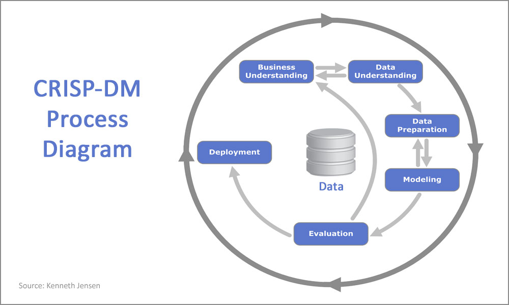
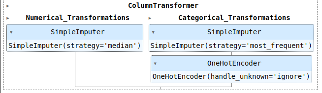

# EverGuardian

**This project is a research study aimed at predicting the likelihood of customers purchasing car insurance, based on data collected from existing customers who possess health insurance. By targeting only the customers who are most likely to purchase insurance, the company can reduce the cost of making unnecessary sales calls.**

**The final product of this project is a Google Sheets document that is linked to the machine learning model that is currently in production. This document provides the list of customers who are likely to purchase car insurance, based on the predictions made by the model.**

**As a result of this project, the company has experienced a 106.91% increase in profitability due to the significant cost savings from reducing the number of unnecessary sales calls.**

## **1 - Business Problems**

### **1.1 - Ever Guardian**

Ever-Guardian is an insurance company that provides health insurance to its customers. With the objective of **maximizing revenue**, Ever-Guardian is starting to **sell vehicle insurance**. Initially, in an effort to **reduce the Customer Acquisition Cost (CAC)**, the insurance company adopted a **cross-selling** strategy to sell a second product to existing customers.

Cross-selling is a sales strategy in which a company offers existing customers the opportunity to purchase additional products or services. This strategy aims to increase revenue by encouraging customers to buy more than one product from the same company. By cross-selling, companies can **reduce customer acquisition costs and increase customer loyalty**, as customers are more likely to remain with a company that offers a range of products and services that meet their needs. In the case of Ever Guardian, adopting a cross-selling strategy by selling vehicle insurance to their existing health insurance customers can help the company **reduce customer acquisition costs and increase revenue**.

### **1.2 - Business Problems**

For a more effective campaign, Ever-Guardian Company has decided to recommend car insurance **only to the customers who are most likely to be interested in it**. This will enable the call center to **make targeted calls to potential customers** who are more likely to purchase car insurance. As a data scientist at Ever-Guardian, my role is to develop a predictive model to determine a customer's propensity to buy vehicle insurance.

### **1.3 - About the data**

---
| Column | Description |
| --- | --- |
|id|                    Unique ID for each customer |
|gender|                Customer gender |
|age|                   Customer age |
|region_code|           Region code where the customer lives |
|policy_sales_channel|  Channel code of contact chosen by the customer |
|driving_license|       Does the customer have a driving license? |
|vehicle_age|           Age of the customer's car |
|vehicle_damage|        Was the customer's car damaged? |
|previously_insured|    Has the customer been insured previously? |
|annual_premium|        Annual premium value (for health insurance) |
|vintage|               Number of days for which the customer has health insurance |
|response|              Is the customer interested in having car insurance? |

---

## **2 - Solution Strategy**

**CRISP-DM** stands for Cross Industry Standard Process for Data Mining, which can be translated as Standard Process for Inter-Industry Data Mining. It is a data mining process model that describes commonly used approaches by data mining experts to tackle problems.

As a basis for this project, I use CRISP, and now, in the **second cycle of CRISP**, I made further iterations, create new features, generate new insights, and improve model performance, all to deliver more value to the company. It is also important to engage with stakeholders in the project throughout the process, to keep them informed and manage their expectations.

All code, visualizations, and analyses for this project can be found at the following links:

[Cycle 02](notebooks/v1.0.ipynb)

[Cycle 01](cycle01)

### **2.1 - Customer Surveys and Business Search**

The first step in this project is to select a **sample of customers and survey them to determine their interest in the new product**. Using this data, we can develop a model to predict each customer's propensity to buy car insurance.

Additionally, some preliminary research on the insurance market has been conducted to gain insights into the industry trends and customer behavior. The results of this research are documented in a notebook and will be used to inform the development of the model.

As this is a research project, we have already obtained the response data from interested customers, which is ready to be used to develop the model. But for it, I have to collect the data in a SQL database.

### **2.2 - Collecting data into an SQL database**

To retrieve the data, I will connect to the SQL database, specifically the PostgreSQL database used by the insurance company. I will then use a Python library that can convert SQL queries into pandas dataframes, allowing for easy manipulation and analysis of the data.

### **2.3 - Data Description**

In the data decription step, the following is checked:
1. The meaning of the features and what each column represents.
2. The dimensions of the data, because if the dataset is too large, it may be necessary to use cloud computing, as local computers may have limitations.
3. If the data has any NA values (Not Available - missing or undefined values).

One time is alright, I'll go to the next step.

### **2.4 - Exploratory Data Analysis ( EDA ) and Hypothesis validation**
During exploratory data analysis, several types of analyses are conducted, including descriptive statistics, univariate, bivariate, and multivariate analysis. The main objective is to gain a better understanding of the data and customer behavior, as well as to extract business insights.

To help me formulate hypotheses, I created a mind map of potential hypotheses.

Top Insights:

1. Almost all customers who already have vehicle insurance are **not interested in purchasing our vehicle insurance**. One probable cause could be that some customers have already contracted insurance for a year, and as they are already paying for their competitor's insurance, they may not be interested in having a second insurance at the moment.

    

2. **The channel that is most frequently used (152) to contact customers has a low conversion rate**, while the second (26) and third (124) most used channels have a good conversion rate. In order to improve the conversion rate, there are some changes that can be implemented such as applying the techniques used in channels 26 and 124 to channel 152, and encouraging customers to migrate to other channels to reduce the demand for the most used channel.

    

### **2.5 - Feature Engineering**
The objective of feature engineering is to transform and create new features from existing data in order to improve the performance of machine learning models. In this step, new features are created by applying mathematical operations or by combining existing features in a meaningful way.

After creating these new features, they are added to a Pipeline object which defines a sequence of data processing steps to be applied to the input data. This ensures that the feature engineering steps are automatically applied along with any other necessary preprocessing steps when the final model is trained and evaluated.

### **2.6 Feature Selection**
Feature selection is the process of selecting a subset of relevant features (variables) from the original set of features that are used to train a machine learning model. The goal is to identify the most important features that have a significant impact on the model's performance.

After analyzing the results of feature importance and gaining insights from exploratory data analysis, I decided to include all the features in the model.

### **2.7 Pre Processing**
Pre-processing refers to the set of steps that are taken to prepare the data for the machine learning model. These steps involve transforming the data, such as dealing with missing values, scaling or normalizing the features, and encoding categorical variables.

Similar to feature engineering, the pre-processing steps are also added to a Pipeline object, which allows them to be applied in a systematic and automated way in the final model.

### **2.8 Models and Hyperparameter Definitions**
In this step, I take the best-performing models from the first cycle and optimize their parameters using Bayesian Search technique. To fine-tune the hyperparameters more accurately, I have created a custom version of BayseanSearchCV that optimizes the parameters using a stratified cross-validation technique. This is particularly useful in cases where the target feature is imbalanced, as it ensures that each fold of the cross-validation contains a representative sample of the minority class.

The code of the customized BayesSearchCV can be seen in this [link](src/bayes_search_cv.py).

The selected models are:
- LGBMClassifier 
- CatBoostClassifier

Another decision that has been made is to use the Precision at K metric for evaluation. Precision at K  measures the proportion of relevant items among the top K recommendations. The goal is to maximize the precision of the recommendations for the user.

| Model | Precision at 30%|
|---|---|
|LGBM Classifier     | 0.32|
|CatBoost Classifier | 0.32|

### **2.8.1 - Ensemble**
To develop a more robust and accurate model, an **ensemble technique** is used, specifically **Bagging**. This technique involves building multiple models independently and combining their predictions. The goal is to reduce variance and increase stability, ultimately improving the overall performance of the model.

### **2.9 - Final model - Pipeline**
With all the results from the previous steps, the final model is developed. Once the model is trained and deployed in the production environment, the Ever Guardian can start calling the selected customers.

### **2.10 - Final Model - Performance**
To evaluate the final model, two methods are used:
1. **Cumulative Gains Curve:** is a visualization tool used in marketing and business analytics to evaluate the effectiveness of a model or a marketing campaign. It shows the proportion of the total positive outcomes achieved by targeting a specific percentage of the population.

    
    
    For example, in the final model, the cumulative gains curve shows what percentage of the total customers would be reached by targeting the **top 20% of prospects (≈ 58%), top 40% (≈ 92%)**, and so on.

2. **Lift Curve:** is a graphical representation that shows the effectiveness of a predictive model in comparison to a random guess. It is commonly used in marketing and customer relationship management to evaluate the performance of models designed to predict customer behavior.

    

    In the final model lift curve, in the case of calling 20% ​​of customers, the model is ≈2.98 times better than the traditional way.

### **2.11 - Business Perfomance**
To evaluate the business performance, I have developed a code that calculates the percentage of customers to contact, the minimum score, and the difference in profits between the traditional method and using the model. 

The evaluation is based on the price of the product and the cost of the operation per customer. And need the list of customers ordered by the score of the model.

The values used were obtained from the website: [bankrate.com](bankrate.com)
- Vehicle Insurance Price: $550.00
- Cost to call to customer: $40.00

### **Minimum score**

In this example is recommended call to 45% of customers ordered by score model. That is the customer's score (threshold) has to be more than 0.19.

### **The difference in profit between traditional way, and using the model**

 #### **By targeting only the customers most likely to purchase, the company can reduce the cost of unnecessary calls. The resulting cost savings make the operation 106.91% more profitable.**

---

 The code of the evaluation business performance can be seen in this [link](src/insurance_evaluation.py).

### **2.12 - Design of Machine Learning Model Framework for Production Deployment**
The final product of this project is a Google Sheets document that is linked to the machine learning model that is currently in production. This document provides the list of customers who are likely to purchase car insurance, based on the predictions made by the model.

### Google Sheets

 The code used to deploy the model can be seen in this [link](deploy).

## 3 - Technologies

## 4 - Author

Lucas da Cunha

Data Scientist

[Project Portfolio](https://jlcunha.github.io/portfolio_projetos/)

[GitHub Profile](https://github.com/jlcunha/)

[Medium](https://medium.com/@lucasdacunh)